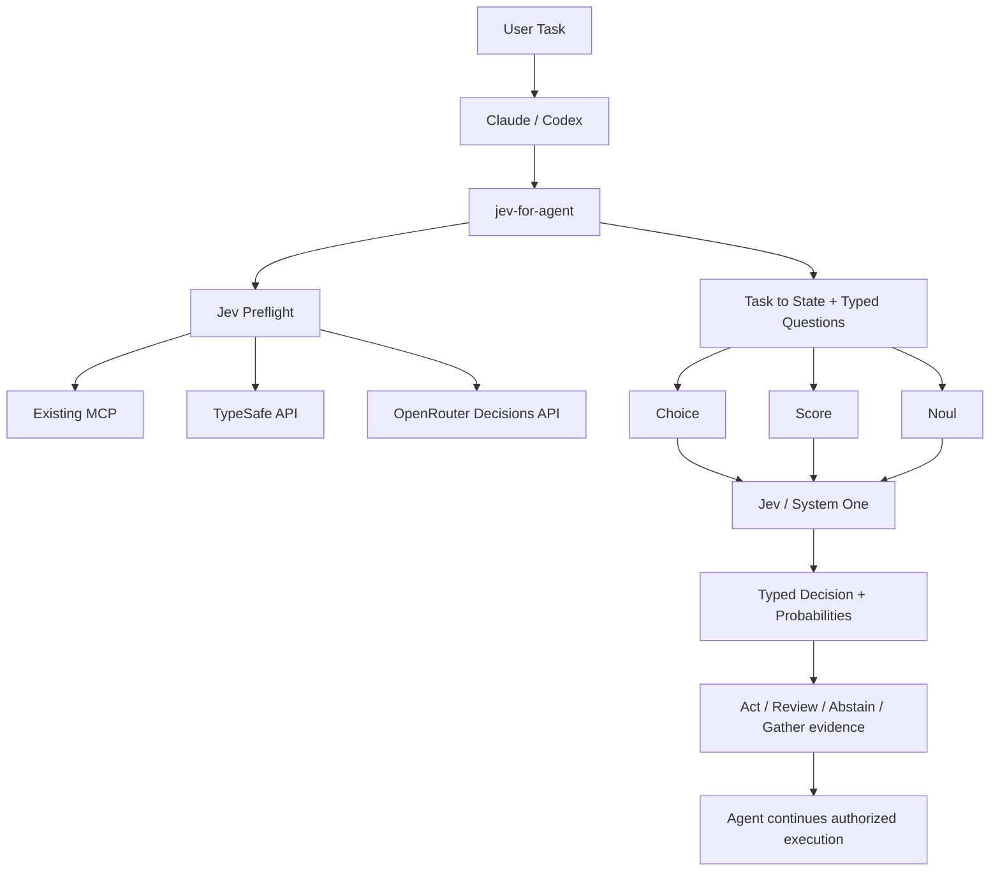
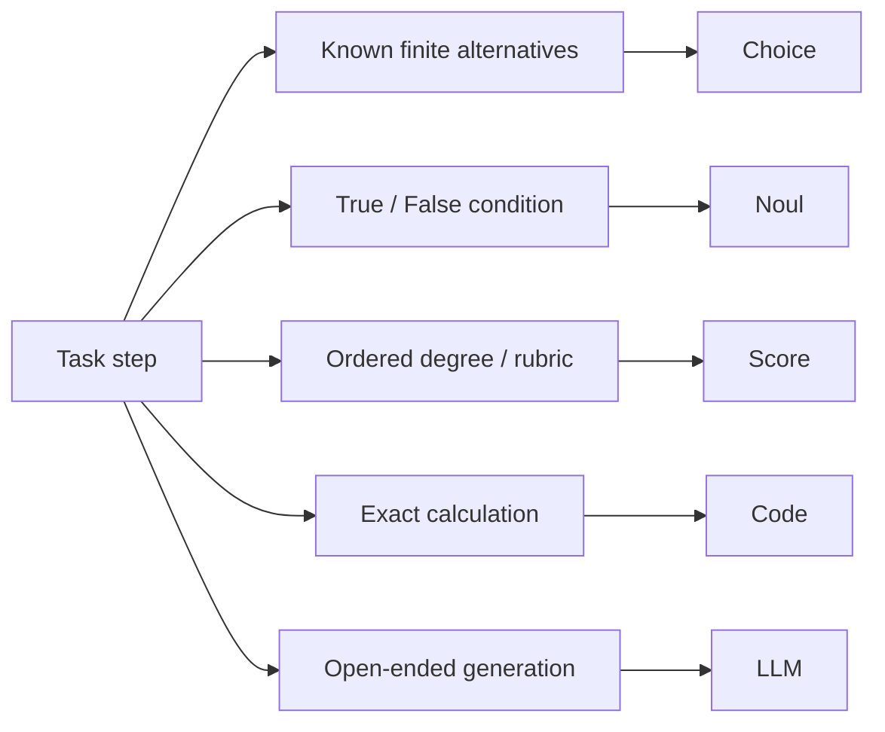

# jev-for-agent

> **让 Agent 想得深，判得快。**
>
> **Think deeply. Decide swiftly.**

将 Jev 作为 Claude Code / Codex 的运行时语义判断层。**Jev decides. Code acts. Agent orchestrates.**

它在实际任务中检测现有 Jev 能力，由 Agent 把自然语言目标拆成 `state + questions`，真实调用 Choice / Score / Noul，再把判断交回 Agent 执行。官方 TypeSafe skill 帮助开发 TypeSafe 应用；本项目帮助正在执行任务的 Agent 使用现有服务。

## 已完成的真实验证

2026-10-04，通过 **OpenRouter Decisions API**，真实响应模型 **typesafe/jev-1.13-20260917**：

| Primitive | 结果 | 输入/输出 tokens | 延迟 ms | usage.cost（原始字段） |
|---|---|---|---|---|
| Choice | PASS | 386 / 38 | 736.044 | 0.000016212 |
| Score | PASS | 356 / 17 | 2717.050 | 0.000014952 |
| Noul | PASS | 352 / 21 | 1477.265 | 0.000014784 |

原始响应、request_id、分布及检查记录见 [live-verification.json](reports/live-verification.json)。最初 Choice 被本地 secret 检查误报（候选标签 password），修正并重新调用；初次记录单独保留。此表证明真实请求与类型校验通过，不代表任务准确率、中文校准或生产 SLA 已证明。

另外，现有 MCP 的三种专项工具已成功 smoke 调用；结算失败示例也真实完成了“测试失败 → Jev 判断 → Agent 修复 → 测试通过”。见 [端到端记录](references/END_TO_END.md)。

## 分工与工作流

| 角色 | 负责 |
|---|---|
| Claude / Codex（System Two） | 理解、规划、检索、生成、写代码、组织工具执行 |
| Jev（System One） | 有限候选选择、明确条件、定义好的等级判断 |
| 普通代码 / 工具 | 精确计算、输入校验、权限、状态和真正业务动作 |





## 安装

需要 **Python 3.11+**、网络和现有已认证 MCP 或 TypeSafe/OpenRouter 凭据。HTTP 实现没有第三方 Python 依赖；有 curl 时优先使用。macOS 系统 Python 可能太旧，可用已安装的新版解释器，或 `uv run --python 3.11 python ...`（首次可能下载运行时）。以下命令均在解压后的 `jev-for-agent/` 中执行。

### GitHub / skills installer

本次交付是本地完整目录及 ZIP，尚未发布 GitHub 仓库，故不提供虚构的远程安装地址。将完整文件夹发布到自己的实际仓库后，可以向 Codex 的 skill-installer 提供该 GitHub URL 与包含 SKILL.md 的路径。其他 installer 须支持 Agent Skills 文件夹；安装时保留 scripts、jev_agent、references 与 examples，不能只复制 SKILL.md。

### Claude Code

根据[官方 Skills 文档](https://code.claude.com/docs/en/skills)，个人技能位于 `~/.claude/skills/`，项目技能位于 `.claude/skills/`。

```bash
python3 scripts/install_skill.py --agent claude --scope user
```

项目安装：

```bash
python3 scripts/install_skill.py --agent claude --scope project --project /path/to/your/project
```

### Codex

根据[官方 Skills 文档](https://learn.chatgpt.com/docs/build-skills)，个人技能位于 `~/.agents/skills/`，项目技能位于 `.agents/skills/`。

```bash
python3 scripts/install_skill.py --agent codex --scope user
```

项目安装：

```bash
python3 scripts/install_skill.py --agent codex --scope project --project /path/to/your/project
```

安装器复制整个包，排除缓存、实际 .env 与临时目录，拒绝覆盖已有安装。升级前比较旧版本并备份，随后自行替换；不要丢弃个人修改。安装后新开会话；若当前客户端未刷新技能列表，重启客户端。

### 手工 / 其他 Agent Skills 宿主

将完整 `jev-for-agent` 文件夹放入宿主实际配置的 skill 搜索目录，确认最终层级为 `.../skills/jev-for-agent/SKILL.md`。本项目遵循 [Agent Skills 规范](https://agentskills.io/specification)，但每个宿主的发现路径、工具权限与脚本执行能力仍需实测。也可用 `--destination /path/to/skills/jev-for-agent` 指定目标。未提供 Claude Plugin metadata，避免把 skill 文件夹误称为已发布插件。

## 调用

Claude Code：

```text
/jev-for-agent 检查当前失败的测试，判断最优先处理的问题，然后修复并验证。
```

Codex CLI / IDE 可显式提及：

```text
$jev-for-agent 检查当前失败的测试，先做 Jev preflight，再判断问题类型并修复。
```

Codex 桌面端也可在技能选择器中选中本技能。自然语言描述匹配时可隐式触发；安装不强制所有任务使用 Jev。纯计算、写作、文件操作若无独立语义判断，直接由 Agent/Code 完成。

非编程例子：

```text
使用 jev-for-agent 对这批服务通知做文档分类，保留中文原文，并对无法覆盖的内容返回 other。
```

对应 [中文文档分类输入](examples/document_classification.json) 和已真实验证的发布说明分类例子。中文效果尚需领域样本独立验证，不假定与英文相同；如进行翻译实验，分别记录 original / translated。

## Preflight 与当前环境

```bash
python3 scripts/jev_doctor.py
python3 scripts/jev_doctor.py --json
python3 scripts/jev_doctor.py --json --probe-mcp jev
python3 scripts/jev_doctor.py --json --discover-models --provider openrouter
```

Doctor 默认只读取元数据，显式 `--probe-mcp` 才启动已配置命令。它区分 server_started、tools_discovered、live_inference：启动成功不等于发现工具，发现工具也不等于推理成功。`--agent-tools` 可接收宿主导出的 tools/list JSON，schema 识别结果只是候选能力。只做 inventory 时 status=PARTIAL 正常，不能擅自标 READY。

本次环境：Codex 已配置 Jev MCP；OpenRouter credential configured，TypeSafe credential missing。MCP initialize 报 **jev-mcp 0.12.0**；本机缓存包 **@jkudish/jev-mcp 0.13.0**；缓存 JS SDK **@typesafe-ai/sdk 0.6.0**；所用 Python 环境没有 typesafe-sdk。缓存版本和运行服务版本有差异，均原样记录。这些版本与 **Jev model typesafe/jev-1.13-20260917** 是不同概念。

现有 MCP 有 12 个专项工具，没有通用 state/questions tool。优先复用它做了 classify/noul/review 调用；review 固定 rubric 且省略 legend，完整原语验收显式选择同账单的 OpenRouter HTTP。配置、握手与实际推理记录分别保存在 reports 中。

## Provider 选择与配置

优先检查当前 Agent 可用工具的真实 schema。适合任务的已连接 MCP 优先；明确配置和账单选择优先于自动策略。没有可用 MCP 时，TypeSafe 再 OpenRouter；失败不会自动切换账单。

凭据通过已有进程环境或 MCP 安全配置注入。`.env.example` 仅列变量，不自动加载，也不写入任何真实 key。至少支持 TYPESAFE_API_KEY、OPENROUTER_API_KEY、JEV_PROVIDER、JEV_MODEL、JEV_MCP_MODEL、TYPESAFE_DEFAULT_MODEL、TYPESAFE_BASE_URL。完整行为见 [PROVIDERS.md](references/PROVIDERS.md)。

| 路径 | 调用方式 | 本次状态 |
|---|---|---|
| TypeSafe Direct | /v1/systemone；先 /v1/models | 实现及离线合约测试；缺独立凭据，未 live 验证 |
| OpenRouter | /api/alpha/decisions；先 Decisions 模型目录 | 三原语和端到端真实通过 |
| Existing MCP | 宿主 callback 或 stdio initialize/tools/list/tools/call | 本机专项工具真实通过；通用适配器离线协议测试 |

OpenRouter 不使用 Chat Completions，模型发现必须筛 `output_modalities=decisions`。model alias 只表示请求选择，实际版本优先取响应字段。本会话内复用目录与连接；新会话或接口变化时重新发现。

## Natural Language Compiler

Agent 理解原始任务并生成 goal / inputs / constraints / candidate_actions / risk / required_output；把每一步分成语义判断、确定性代码、生成工作、工具动作。Agent 才负责自然语言语义编译；Python compiler 负责 schema 与分工约束检查。

```bash
python3 scripts/compile_packet.py examples/triage_plan.json --output packet.json
python3 scripts/validate_packet.py packet.json
python3 scripts/evaluate.py packet.json --provider openrouter --output result.json
```

同 state 的独立问题可以批处理。Q2 若需要 Q1 答案才能取证，必须下一轮。ID 只是程序标识，每题 instructions 都要完整。Choice 候选尽量同一维度，Score 等级完整独立可读，Noul 清晰定义 true。

## 验证与安全策略

交付验收：51 项 unittest 全部通过（显式启用真实 API 集成测试，无跳过）；独立端到端工程 2 项测试通过；SKILL 格式校验通过；Claude/Codex 项目目录已在临时目录实际试装。详见 reports/test-suite.txt。

离线测试（不产生推理费用）：

```bash
python3 -m unittest discover -s tests -v
```

独立真实验收（实际网络/计费）：

```bash
python3 scripts/verify_primitives.py --provider openrouter --all --output verification.json
python3 scripts/verify_primitives.py --provider typesafe --model jev-latest --all
```

可选 `--primitive choice|score|noul`、`--model`、`--mcp-name`。不指定 provider 会检测现有配置；只有专项 MCP 时，通用 packet CLI 会提示使用宿主专项工具或显式选择已确认账单的 HTTP。缺少凭据且无 MCP 时输出 `LIVE VERIFICATION BLOCKED: NO JEV CREDENTIAL`。

全套 unittest 中付费集成测试默认跳过；主动执行可设置 `JEV_RUN_LIVE=1 JEV_PROVIDER=openrouter python3 -m unittest discover -s tests -v`。离线 fixtures 明确限定在 tests，不是 FakeProvider，也不能充当 live 成功证据。

输入在付费调用前校验，响应校验 ID/type、候选、分布、legend 与合法范围。保留原始回答，不为了统一格式修改概率。权限、freshness、business rules 和副作用仍需代码验证。示例 gate 分为 act / review / abstain / gather_more_evidence；.85 仅为 example/default policy。Noul .5 是不确定，Score 是 rubric 位置，confidence 不等于 accuracy。

API key 不进入 state、tool arguments、日志、错误正文或 Git。请求采用 HTTPS、禁止跟随重定向，仅限流/过载有界重试。超时与连接错误不重试以减少重复计费。原始响应含任务内容，使用者仍需按数据敏感性管理报告；密钥检测不是通用 DLP。

## 故障排查

| 现象 | 处理 |
|---|---|
| Python 版本过旧 | 使用 Python 3.11+ 或 uv run --python 3.11 |
| Doctor PARTIAL | 表示环境/发现信息，继续真实 inference 检查；不是成功推理证明 |
| MCP 启动成功但无通用工具 | 读其专项 schema；用宿主工具，或显式选同账单 HTTP |
| 多个同名 MCP / 多账单配置 | 指定明确 provider；先消除配置歧义 |
| 模型未发现 | 重查当天模型目录和官方文档，不换成 chat router |
| HTTP 401 / 403 | 检查进程凭据及账号权限，不打印密钥 |
| HTTP 429 / 529 | 已有界退避；持续失败时稍后重试或查额度 |
| HTTP transport failed | 检查网络；可选 curl/urllib；状态未知时勿反复付费重试 |
| response schema rejected | 保留安全诊断，核对 Provider schema；不把失败解释成否定答案 |
| confidence 缺失 / 偏低 | review 或补证据，不生成伪 confidence |

## FAQ

**它能自动理解任意自然语言吗？** 当前宿主 Agent 负责理解；附带 Python 脚本只校验 Agent 写好的 plan/packet。

**为什么还有 LLM？** Jev 的有限判断与 Agent 的规划、生成、执行互补。

**高 confidence 就能发布/删除吗？** 不行。真正权限与动作规则独立执行，高风险仍需相应检查。

**MCP 客户端版本就是 Jev 版本吗？** 不是。分别记录客户端/SDK 与实际模型字段。

**没有 API key 可以测试吗？** 已认证 MCP 可以；否则只能离线校验，不得宣称 live 通过。

**安装后是否所有任务都会调用 Jev？** 不会。只有适合的语义判断才调用。

## 文件与限制

- SKILL.md：触发条件、preflight、A–I protocol 与三原语模板。
- jev_agent/：静态验证、provider、stdio MCP、doctor、compiler、gate。
- scripts/：安装、诊断、编译、校验、调用与真实验收。
- examples/：独立与混合原语、中文文档分类、结算失败计划与样例工程。
- references/：概念、模式、接口、来源与端到端记录。
- tests/：离线 fixtures 和显式付费集成测试。
- reports/：真实推理和验收证据；不参与运行时决策。

未验证：TypeSafe Direct 实际推理、真实通用 state/questions MCP、远程 MCP 自建传输、Claude Code 实机加载运行、中文业务准确率/校准、生产负载与长时间稳定性。Claude/Codex 安装目录已在临时目录验证复制，未改动用户全局技能目录。Doctor 不枚举所有 virtualenv/包管理器，模型发现与 API schema 是当日快照，需后续维护。

## 来源

按当天官方 Docs/API → 官方 SDK 类型 → OpenRouter 官方 → TypeSafe Skill → Blog → Datawhale → Gallery → 用户 PDF → 第三方 MCP 顺序处理接口冲突。完整链接、采集覆盖和当前版本边界见 [SOURCES.md](references/SOURCES.md)。
